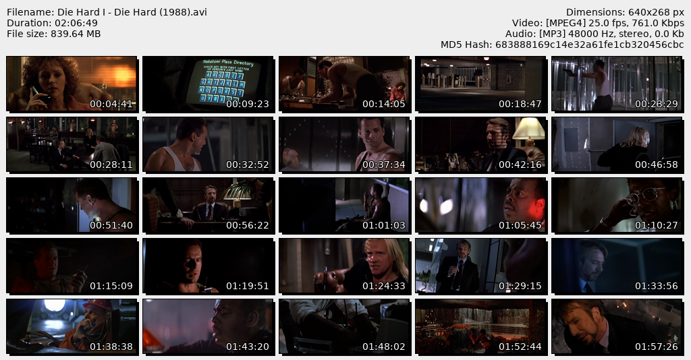

# Thumbsheet


Thumbsheet is a console application that generates a set of thumbnails
from a video (or list of videos). See the section [Comparison](#comparison)
below for an example of the output image.


## Quickstart

Note: this requires `ffmpeg` to be installed outside of Python. The applications
`ffmpeg` and `ffprobe` should be usable from your PATH for thumbsheet to find them.

```bash
python3 -m venv env
source env/bin/activate
pip3 install -r requirements.txt

python3 thumbsheet.py '~/vid/Die Hard I.avi'
# Creates file Die Hard I.png next to the original video
```

To make thumbsheets for multiple videos, you have multiple options:

1. Pass multiple file names to the command:

        python3 thumbsheet.py '~/vid/Die Hard I.avi' '~/vid/Die Hard II.avi'

2. Use shell [globbing](https://en.wikipedia.org/wiki/Glob_(programming))
   wildcards to grab multiple videos (similar to passing multiple file names):

        python3 thumbsheet.py ~/vid/*.avi

3. Use [Python globbing](https://docs.python.org/3/library/glob.html) which adds
   the additional wildcard `**` for recursive directory traversal. It matches
   zero or more intermediate directories so you can create thumbnails for an
   entire folder hierarchy at once. However, since your shell will proactively
   evaluate wildcards, you must wrap the pattern in quotes (either single or
   double quotes should work).

        python3 thumbsheet.py '~/vid/**/*.avi'

The application has a built-in list of allowed file extensions based on
[this list from Wikipedia](https://en.wikipedia.org/wiki/Video_file_format#List_of_video_file_formats).
This means that, by default, it should be safe to recursively process a directory
containing video files in multiple formats and other, non-video files without
the application trying to process the non-video files.

For example, if a directory contains a `.txt` file, a `.avi` file, and a `.mp4`
file, running `python3 thumbsheet.py '~/vid/**'` will generate thumbnails for
only the `.avi` and `.mp4` file. If this behavior is not desired, add the `-a`
or `--all` argument (`python3 thumbsheet.py -a '~/vid/**'`) to force the application
to process any file sent to it. This may cause unexpected crashes if it reads
the wrong type of file.


## Size and Shape

By default, the application generates a 5x5 grid of thumbnails and the entire
thumb sheet is 1024 pixels wide. The height is scaled with the number of rows
and cannot be set independently.

To set the width, use the argument `-w` or `--width`:

    python3 thumbsheet.py -w 512 '~/vid/*.mp4'

To change the grid size, use `-d` or `--dimensions` in WidthXHeight format:

    python3 thumbsheet.py -d 4x3 '~/vid/*.mp4'


## Hashing

File hashing can be used as a verification tool to ensure a file has not been
modified. By default, this application will generate a hash using the MD5 format
and display it in the header. This can be compared to the file using a program
like `md5sum` to ensure the file has not been modified since the thumbnail was
generated. Depending on file size, hashing can be a slow operation. If you
do not need hashing and want to speed up thumbsheet generation, pass the following
argument:

    python3 thumbsheet.py --hash none '~/vid/*.mp4'

Instead of `none`, you can also use the string `md5` to choose md5 (the default)
or `sha1` to choose the sha1 algorithm.


## Output Directory

By default, images are placed in the same folder as the original video. If
you'd prefer to collect all thumbsheets in a separate folder, use the
`--output-dir` argument:

    python3 thumbsheet.py --output-dir thumbnails/ '~/vid/*.mp4'


## Filename Pattern

The filename pattern argument `-p` supports all Python string formatting
features. Three keyword arguments are provided when formatting:

* `{stem}`: The filename without original extension (this is the default format)
* `{name}`: The filename with extension
* `{idx}`: The index in processing queue, beginning at 1. When sorting input,
           index 1 starts at the first video alphabetically.

```bash
python thumbsheet.py -p '{idx:03d}. {stem}' '~/vid/playlist/*'
# Numbers each thumbsheet by its processing index with padding
# e.g. "001. Video.jpg"
```


## Comparison

Other good alternatives (Linux only):

Video Contact Sheet (VCS): <http://p.outlyer.net/vcs>  
SlickSlice: <http://slickslice.sourceforge.net/>

Note: time comparisons are not scientific and can vary wildly between
different file formats (e.g. mkv) even for similarly-sized files.

### Thumbsheet

    python3 thumbsheet.py -d 5x5 '~/vid/Die Hard I.avi'

Time to process: ~5.9 seconds



### VCS

    vcs -n25 -c5 -H100 '~/vid/Die Hard I.avi'
    # Capping height at 100px so that output file isn't too large

Time to process: ~13.4 seconds


### SlickSlice

    slickslice-0.9 -S 5x5 -x '~/vid/Die Hard I.avi'

Time to process: ~2.9 seconds

