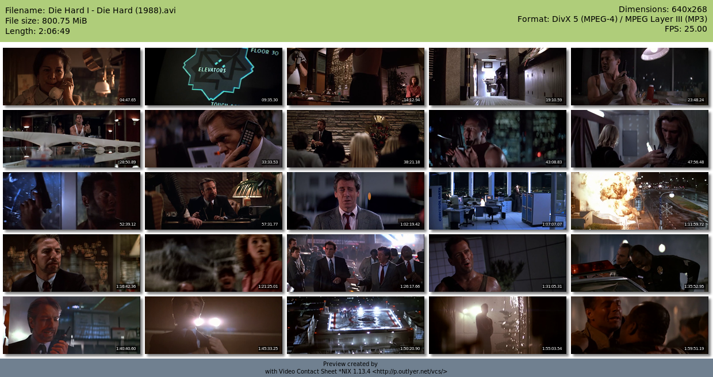

# Thumbsheet


## Filename Pattern

The filename pattern argument `-p` supports all Python string formatting
features. Three keyword arguments are provided when formatting:

* `{stem}`: The filename without original extension (this is the default format)
* `{name}`: The filename with extension
* `{idx}`: The index in processing queue, beginning at 1. When sorting input,
           index 1 starts at the first video alphabetically.

```bash
python thumbsheet.py -p '{idx:03d}. {stem}' '~/vid/playlist/*'
# Numbers each thumbsheet by its processing index with padding
# e.g. "001. Video.jpg"
```


## Comparison

Other good alternatives (Linux only):

Video Contact Sheet (VCS): <http://p.outlyer.net/vcs>  
SlickSlice: <http://slickslice.sourceforge.net/>

Note: time comparisons are not scientific and can vary wildly between
different file formats (e.g. mkv) even for similarly-sized files.

### Thumbsheet

    python3 thumbsheet.py -d 5x5 '~/vid/Die Hard I.avi'

Time to process: ~5.9 seconds


### VCS

    vcs -n25 -c5 -H100 '~/vid/Die Hard I.avi'
    # Capping height at 100px so that output file isn't too large

Time to process: ~13.4 seconds



### SlickSlice

    slickslice-0.9 -S 5x5 -x '~/vid/Die Hard I.avi'

Time to process: ~2.9 seconds

